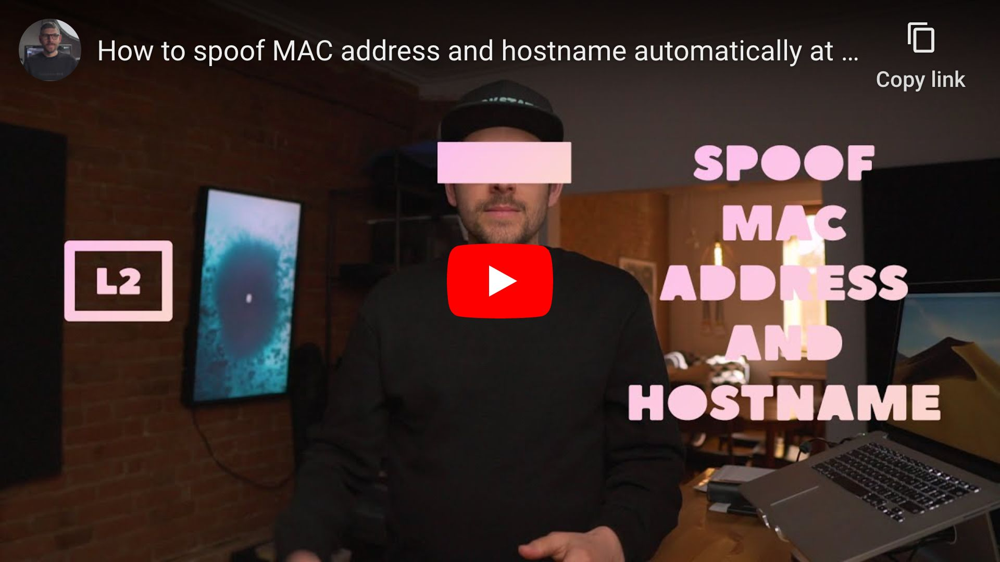

<!--
Title: How to spoof MAC address and hostname automatically at boot on macOS
Description: Learn how to spoof MAC address and hostname automatically at boot on macOS.
Author: Sun Knudsen <https://github.com/sunknudsen>
Contributors: Sun Knudsen <https://github.com/sunknudsen>
Reviewers:
Publication date: 2020-05-19T00:00:00.000Z
Listed: true
Pinned:
-->

# How to spoof MAC address and hostname automatically at boot on macOS

[](https://www.youtube.com/watch?v=ASXANpr_zX8 "How to spoof MAC address and hostname automatically at boot on macOS")

> Heads-up: unfortunately, it is not possible to spoof MAC address on some Macs (see [issue](https://github.com/sunknudsen/privacy-guides/issues/15)).

## Requirements

- Computer running macOS Catalina or Big Sur

## Caveats

- When copy/pasting commands that start with `$`, strip out `$` as this character is not part of the command
- When copy/pasting commands that start with `cat << "EOF"`, select all lines at once (from `cat << "EOF"` to `EOF` inclusively) as they are part of the same (single) command

## Guide

### Step 1: create `/usr/local/sbin` directory

```shell
sudo mkdir -p /usr/local/sbin
sudo chown ${USER}:admin /usr/local/sbin
```

### Step 2: add `/usr/local/sbin` directory to `PATH` environment variable

```shell
echo 'export PATH=$PATH:/usr/local/sbin' >> ~/.zshrc
source ~/.zshrc
```

### Step 3: download [first-names.txt](./first-names.txt)

This list includes top 2048 most popular names for people aged 25 from the [USA Social Security Administration](https://www.ssa.gov/oact/babynames/limits.html) (last [updated](./misc/update-first-names.sh) on March 9th 2022).

```shell
curl --fail --output /usr/local/sbin/first-names.txt https://sunknudsen.com/privacy-guides/how-to-spoof-mac-address-and-hostname-automatically-at-boot-on-macos/first-names.txt
```

### Step 4: create `spoof.sh` script

```shell
cat << "EOF" > /usr/local/sbin/spoof.sh
#! /bin/sh

set -e
set -o pipefail

export LC_CTYPE=C

basedir=$(dirname "$0")

# Spoof computer name
first_name=$(sed "$(jot -r 1 1 2048)q;d" $basedir/first-names.txt | sed -e 's/[^a-zA-Z]//g')
model_name=$(system_profiler SPHardwareDataType | awk '/Model Name/ {$1=$2=""; print $0}' | sed -e 's/^[ ]*//')
computer_name="$first_name’s $model_name"
host_name=$(echo $computer_name | sed -e 's/’//g' | sed -e 's/ /-/g')
sudo scutil --set ComputerName "$computer_name"
sudo scutil --set LocalHostName "$host_name"
sudo scutil --set HostName "$host_name"
printf "%s\n" "Spoofed hostname to $host_name"

# Spoof MAC address of Wi-Fi interface
mac_address_prefix=$(networksetup -listallhardwareports | awk -v RS= '/en0/{print $NF}' | head -c 8)
mac_address_suffix=$(openssl rand -hex 3 | sed 's/\(..\)/\1:/g; s/.$//')
mac_address=$(echo "$mac_address_prefix:$mac_address_suffix" | awk '{print tolower($0)}')
networksetup -setairportpower en0 on
sudo /System/Library/PrivateFrameworks/Apple80211.framework/Versions/Current/Resources/airport --disassociate
sudo ifconfig en0 ether "$mac_address"
printf "%s\n" "Spoofed MAC address of en0 interface to $mac_address"
EOF
```

### Step 5: make `spoof.sh` executable

```shell
chmod +x /usr/local/sbin/spoof.sh
```

### Step 6: create `local.spoof.plist` launch daemon

```shell
cat << "EOF" | sudo tee /Library/LaunchDaemons/local.spoof.plist
<?xml version="1.0" encoding="UTF-8"?>
<!DOCTYPE plist PUBLIC "-//Apple//DTD PLIST 1.0//EN" "http://www.apple.com/DTDs/PropertyList-1.0.dtd">
<plist version="1.0">
  <dict>
    <key>Label</key>
    <string>local.spoof</string>

    <key>ProgramArguments</key>
    <array>
        <string>/usr/local/sbin/spoof.sh</string>
    </array>

    <key>RunAtLoad</key>
    <true/>
  </dict>
</plist>
EOF
```

### Step 7: create `spoof-hook.sh` script

```shell
cat << "EOF" > /usr/local/sbin/spoof-hook.sh
#! /bin/sh

# Turn off Wi-Fi interface
networksetup -setairportpower en0 off
EOF
```

### Step 8: make `spoof-hook.sh` executable

```shell
chmod +x /usr/local/sbin/spoof-hook.sh
```

### Step 9: make sure `com.apple.loginwindow` does not exist

> Heads-up: if `com.apple.loginwindow` exists, one needs to backup user default carefully and consider using an abstraction that runs both current `LogoutHook` script and `/usr/local/sbin/spoof-hook.sh`.

```console
$ sudo defaults read com.apple.loginwindow
2021-09-27 06:58:02.301 defaults[2267:25227]
Domain com.apple.loginwindow does not exist
```

Domain com.apple.loginwindow does not exist

👍

### Step 10: configure user default (used to disable Wi-Fi interface at logout)

```shell
sudo defaults write com.apple.loginwindow LogoutHook "/usr/local/sbin/spoof-hook.sh"
```

### Step 11: reboot and confirm hostname and MAC address have been spoofed

#### Spoofed hostname

```console
$ scutil --get HostName
Ottos-MacBook-Pro
```

#### Spoofed MAC address

```console
$ ifconfig en0 | grep ether | awk '{print $2}'
98:01:a7:8e:0f:51
```

#### Hardware MAC address

```console
$ networksetup -listallhardwareports | awk -v RS= '/en0/{print $NF}'
98:01:a7:5e:d0:c2
```

“Spoofed hostname” is random and “Spoofed MAC address” does not match “Hardware MAC address”?

👍

---

## Want things back the way they were before following this guide? No problem!

### Step 1: delete files

```shell
rm /usr/local/sbin/first-names.txt
rm /usr/local/sbin/spoof-hook.sh
rm /usr/local/sbin/spoof.sh
sudo rm /Library/LaunchDaemons/local.spoof.plist
```

### Step 2: delete user default

```shell
sudo defaults delete com.apple.loginwindow LogoutHook
```

### Step 3: set computer name, local hostname and hostname

> Heads-up: replace `John` with your name.

```shell
sudo scutil --set ComputerName "John’s MacBook Pro"
sudo scutil --set LocalHostName "Johns-MacBook-Pro"
sudo scutil --set HostName "Johns-MacBook-Pro"
```

### Step 4: reboot

👍
